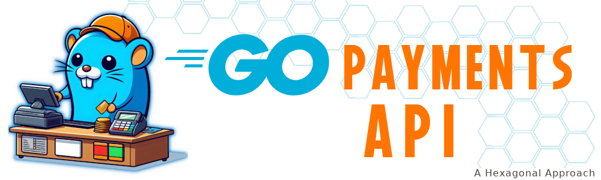
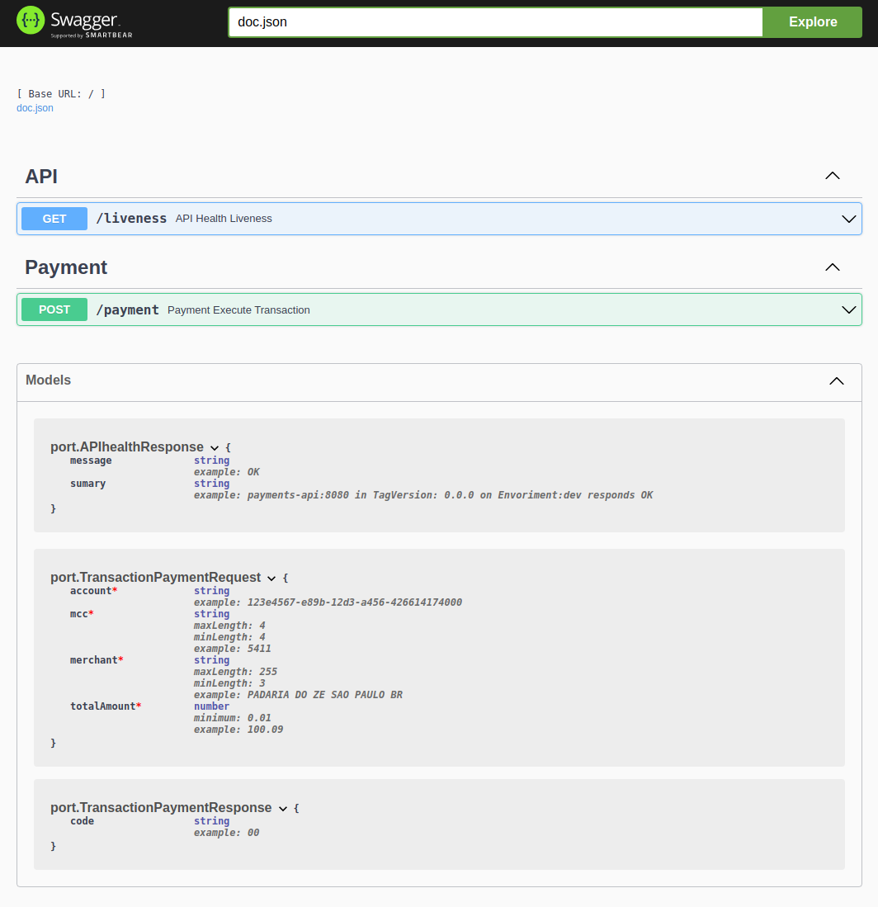
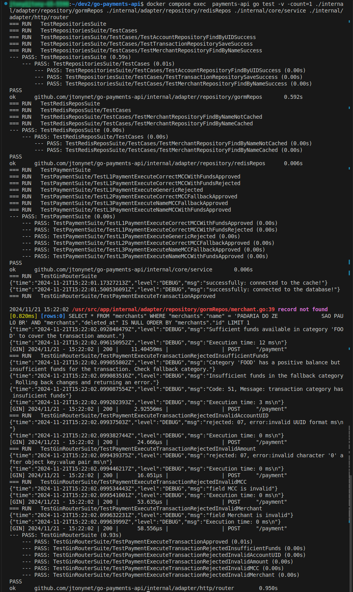
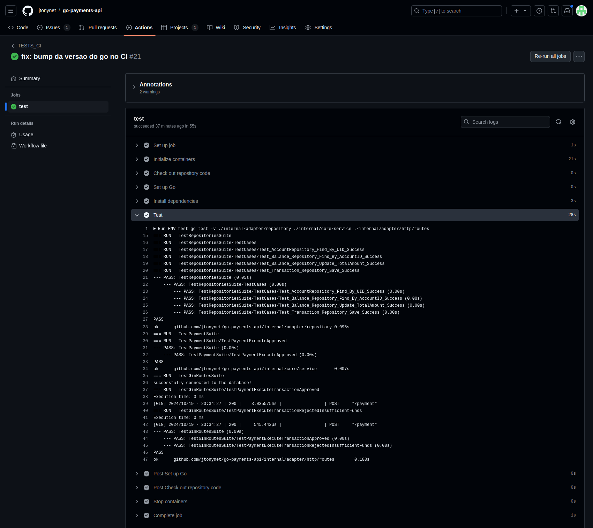
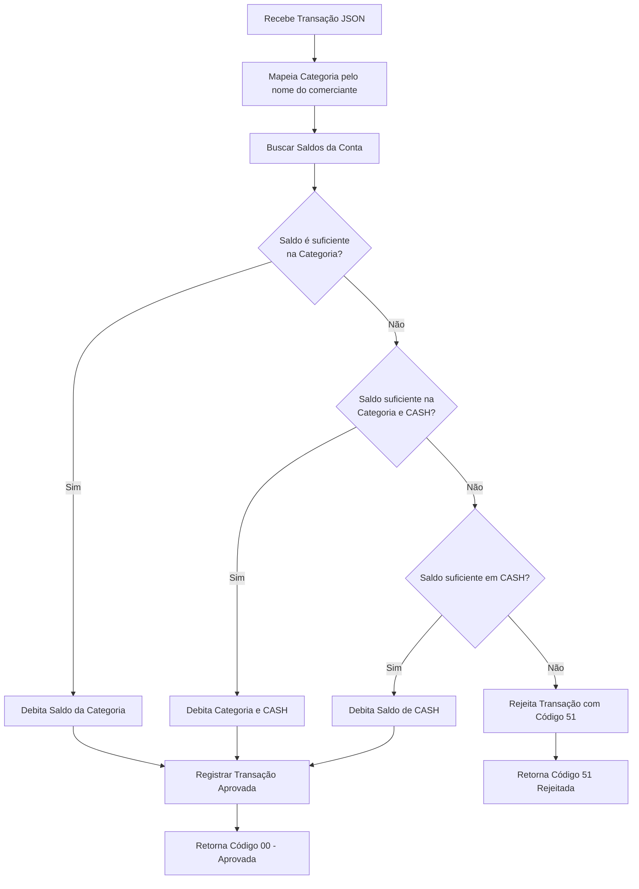
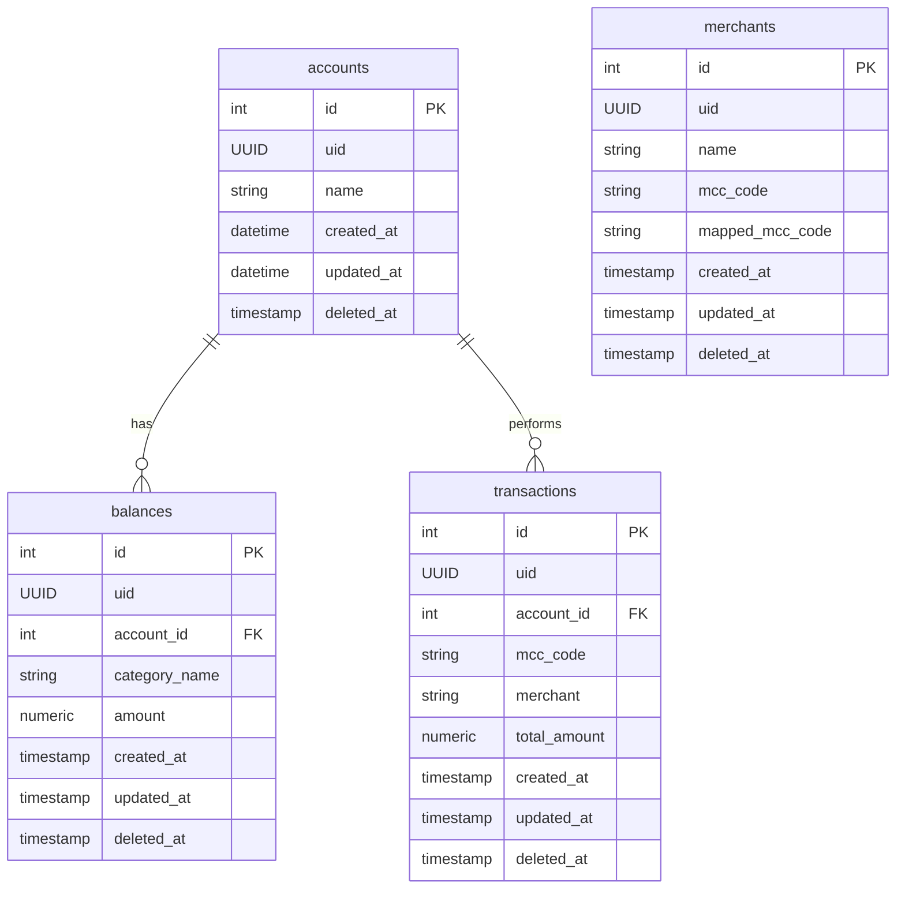
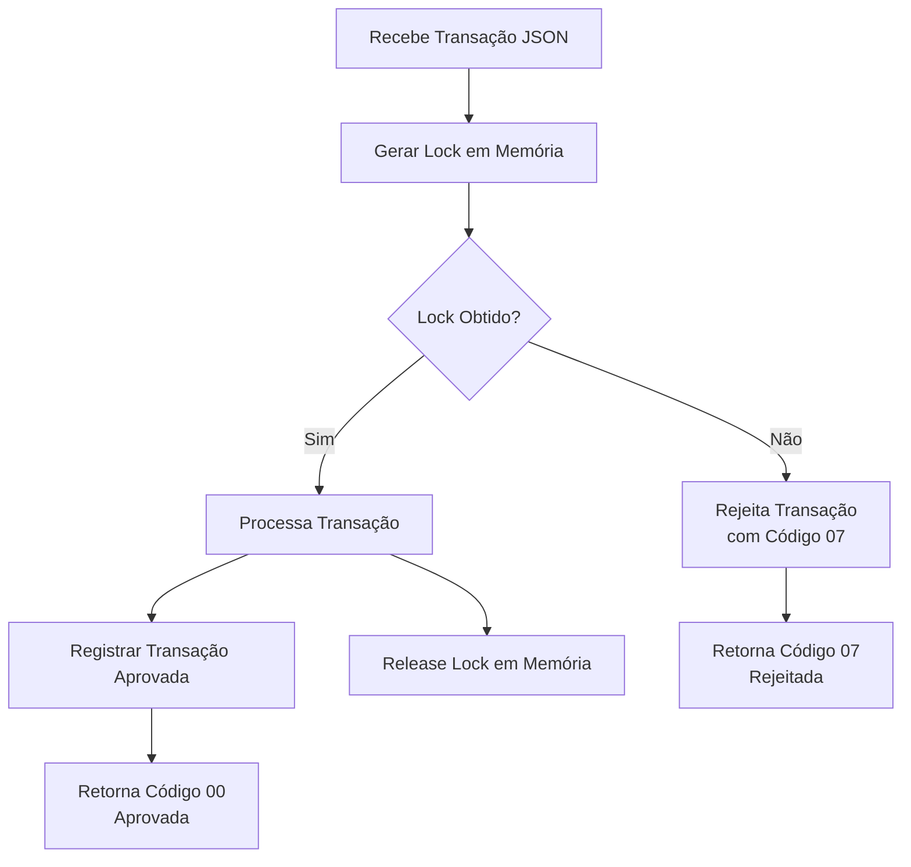

<a id="header"></a>

<!-- 
    Logo image generated by Bing IA: https://www.bing.com/images/create/
    Prompt: gopher azul, simbolo da linguagem golang com um bone laranja, trabalhando como caixa de supermercado com algumas maquinhas de cartão de credito e cartões em cima da mesa, estilo cartoon, historia em quadrinhos, fundo branco chapado para facilitar remoção
-->
[](#rgo-turn-based-challenge)

<!-- 
    icons by:
    https://devicon.dev/
    https://simpleicons.org/
-->
[](https://go.dev/) [](https://gin-gonic.com/) [](https://www.postgresql.org/) [](https://www.docker.com/) [](https://ubuntu.com/) [](https://github.com/spf13/viper) [](https://github.com/jtonynet)  [](https://code.visualstudio.com/) [](https://swagger.io/) [](https://mermaid.js.org/) [](https://docs.github.com/en/actions) <!-- [](https://prometheus.io/) [](https://grafana.com/)  [](https://gatling.com/) [](https://redis.com/) [](https://rabbitmq.com/) -->


[](#header) [](https://github.com/users/jtonynet/projects/7/views/1)  [](https://github.com/jtonynet/go-payments-api/actions)
>


## 🕸️ Redes

[](https://www.linkedin.com/in/jos%C3%A9-r-99896a39/) [](https://dev.to/learningenuity) [](mailto:learningenuity@gmail.com)

---

## 📁 O Projeto

<a id="index"></a>
### ⤴️ Índice


__[Go Payments API](#header)__<br/>
  1.  ⤴️ [Índice](#index)
  2.  📖 [Sobre](#about)
  3.  💻 [Rodando o Projeto](#run)
      - 🌐 [Ambiente](#environment)
      - 🐋 [Conteinerizado](#run-containerized)
      - 🏠 [Local](#run-locally)
  4.  📰 [Documentação da API](#api-docs)
  5.  ✅ [Testes](#tests)
      - 🐋 [Conteinerizado](#test-containerized)
      - 🏠 [Local](#test-locally)
      - ⚙️[Automatizados](#test-auto)
      - 🧑‍🔧[Manuais](#test-manual)
  6.  📊 [Diagramas](#diagrams)
      - 📈 [Fluxo](#diagrams-flowchart)
      - 📈 [ER](#diagrams-erchart)
  7.  🅻4️⃣ [Questão Aberta L4](#open-question)
  8.  👏 [Boas Práticas](#best-practices)
  9.  🧠 [ADR - Architecture Decision Records](#adr)
  10. 🔢 [Versões](#versions)
  11. 🧰 [Ferramentas](#tools)
  12. 🤖 [Uso de IA](#ia)
  13. 🏁 [Conclusão](#conclusion)

---

<a id="about"></a>
### 📖 Sobre

Acompanhe as tarefas pelo __[Kanban](https://github.com/users/jtonynet/projects/7/views/1)__

Este repositório foi criado com a intenção de propor uma possível solução para o seguinte desafio:

> <br/>
> 
> 👨‍💻 __Desafio Técnico:__
>
> Além de avaliar a correção da sua solução, temos interesse em ver como você modela o domínio, organiza seu código e implementa seus testes. 
>
>
> __Linguagem e bibliotecas:__
> 
> Na *********, usamos Scala e Kotlin no nosso dia a dia (e demonstrar experiência em alguma delas é um grande diferencial). No entanto, você pode implementar sua solução utilizando sua linguagem favorita, dando preferência ao paradigma de programação funcional.
>
> __Como entregar a solução?__
> 
> Entregue a sua solução preferencialmente criando um repositório git (Github, Gitlab, etc).
>
> É muito importante escrever um arquivo README com as instruções para execução do projeto.
> 
> Agora, vamos guiá-lo através de alguns conceitos básicos.
> 
> <br/>
> 
> ---
> 
> <br/>
> 
> __Transaction__
>
> Uma versão simplificada de um transaction payload de cartão de crédito é o seguinte:
>
> ```json
> {
> 	"account": "123",
> 	"totalAmount": 100.00,
> 	"mcc": "5811",
> 	"merchant": "PADARIA DO ZE               SAO PAULO BR"
> }
> ```
>
>
> __Atributos__
>
> - **id** - Um identificador único para esta transação.
> - **accountId** - Um identificador para a conta.
> - **amount** - O valor a ser debitado de um saldo.
> - **merchant** - O nome do estabelecimento.
> - **mcc** - Um código numérico de 4 dígitos que classifica os estabelecimentos comerciais de acordo com o tipo de produto vendido ou serviço prestado.
>    
>    O `MCC` contém a classificação do estabelecimento. Baseado no seu valor, deve-se decidir qual o saldo será utilizado (na totalidade do valor da transação). Por simplicidade, vamos usar a seguinte regra:
>    
>    - Se o `mcc` for `"5411"` ou `"5412"`, deve-se utilizar o saldo de `FOOD`.
>    - Se o `mcc` for `"5811"` ou `"5812"`, deve-se utilizar o saldo de `MEAL`.
>    - Para quaisquer outros valores do `mcc`, deve-se utilizar o saldo de `CASH`.
>
> <br/>
> 
> ---
>
> <br/>
> 
> __Desafios (o que você deve fazer)__
> 
> Cada um dos desafios a seguir são etapas na criação de um autorizador completo. Seu autorizador deve ser um servidor HTTP que processe a transaction payload JSON usando as regras a seguir.
>
> As possíveis respostas são:
> - `{ "code": "00" }` se a transação é **aprovada**
> - `{ "code": "51" }` se a transação é **rejeitada**, porque não tem saldo suficiente
> - `{ "code": "07" }` se acontecer qualquer outro problema que impeça a transação de ser processada
>
> __O HTTP Status Code é sempre `200`__
> 
>
><br/>
>
> 1. __L1. Autorizador simples__
>     - O __autorizador simples__ deve funcionar da seguinte forma:
>       -  Recebe a transação
>       -  Usa **apenas** a MCC para mapear a transação para uma categoria de benefícios
>       -  Aprova ou rejeita a transação
>       -  Caso a transação seja aprovada, o saldo da categoria mapeada deverá ser diminuído em __totalAmount__.
>
> 2. __L2. Autorizador com fallback__
>     - Para despesas não relacionadas a benefícios, criamos outra categoria, chamada __CASH__. O autorizador com fallback deve funcionar como o autorizador simples, com a seguinte diferença:
>       - Se a MCC não puder ser mapeado para uma categoria de benefícios ou se o saldo da categoria fornecida não for suficiente para pagar a transação inteira, verifica o saldo de **CASH** e, se for suficiente, debita esse saldo.
>
> 3. __L3.Dependente do comerciante__
>     - As vezes, os MCCs estão incorretos e uma transação deve ser processada levando em consideração também os dados do comerciante. Crie um mecanismo para substituir MCCs com base no nome do comerciante. O nome do comerciante tem maior precedência sobre as MCCs.
>     - Exemplos:
>       - `UBER TRIP                   SAO PAULO BR`
>       - `UBER EATS                   SAO PAULO BR`
>       - `PAG*JoseDaSilva          RIO DE JANEI BR`
>       - `PICPAY*BILHETEUNICO           GOIANIA BR`
>   
> 4. __L4. Questão aberta__
>     - A seguir está uma questão aberta sobre um recurso importante de um autorizador completo (que você não precisa implementar, apenas discuta da maneira que achar adequada, como texto, diagramas, etc.).
>       - Transações simultâneas: dado que o mesmo cartão de crédito pode ser utilizado em diferentes serviços online, existe uma pequena mas existente probabilidade de ocorrerem duas transações ao mesmo tempo. O que você faria para garantir que apenas uma transação por conta fosse processada em um determinado momento? Esteja ciente do fato de que todas as solicitações de transação são síncronas e devem ser processadas rapidamente (menos de 100 ms), ou a transação atingirá o timeout.
> 
> <br/>
> 
> ---
>
> <br/>
> 
> _Para este teste, tente ao máximo implementar um sistema de autorização de transações considerando todos os desafios apresentados (L1 a L4) e conceitos básicos._
> 
> <br/>

<br/>

O desafio sugere `Scala`, `Kotlin` e o `paradigma de programação funcional`, evidenciando preferências, mas aceitando subscrições com outras linguagens e paradigmas. Realizarei em `Golang`, com arquitetura [`hexagonal`](https://alistair.cockburn.us/hexagonal-architecture/), por maior familiaridade e experiência além de entender que essa linguagem e arquitetura se encaixam ao desafio.

Contudo, sou aberto a expandir minhas habilidades, e disposto a aprender e adotar novas tecnologias e paradigmas conforme necessário.

<br/>

[⤴️ de volta ao índice](#index)

---

<a id="run"></a>
### 💻 Rodando o Projeto

<a id="environment"></a>
#### 🌐 Ambiente

`Docker` e `Docker Compose` são necessários para rodar a aplicação de forma containerizada, e é fortemente recomendado utilizá-los para rodar o banco de dados localmente.

Crie uma copia do arquivo `./payments-api/.env.SAMPLE` e renomeie para `./payments-api/.env`.

<br/>

<a id="run-containerized"></a>
#### 🐋 Conteinerizado 

Após a `.env` renomeada, rode os comandos `docker compose` (de acordo com sua versão do docker compose) no diretório raiz do projeto:

```bash
# Construir a imagem
docker compose build

# Rodar o PostgreSQL de Desenvolvimento
docker compose up postgres-payments -d

# Rodar a API
docker compose up payments-api
```
 A API está pronta e a rota da [Documentação da API](#api-docs) (Swagger) estará disponível, assim como os [Testes](#tests) poderão ser executada.

<br/>

<a id="run-locally"></a>
#### 🏠 Local

Com o `Golang 1.23` instalado e após ter renomeado a copia de `.env.SAMPLE` para `.env`, serão necessárias outras alterações para que a aplicação funcione corretamente no seu `localhost`.

No arquivo `.env`, substitua os valores das variáveis de ambiente que contêm comentários no formato `local: valueA | containerized: valueB` pelos valores sugeridos na opção `local`.
```bash
DATABASE_HOST=localhost # local: localhost | conteinerized: postgres-payments
```

Após editar o arquivo, suba apenas o banco de dados com o comando:

```bash
# Rodar o PostgreSQL de Desenvolvimento
docker compose up postgres-payments
```
ou se conecte a uma database válida no arquivo `.env`, então no diretório `payments-api` execute os comandos:

```bash
# Instala Dependências
go mod download

# Rodar a API
go run cmd/http/main.go
```
 A API está pronta e a rota da [Documentação da API](#api-docs) (Swagger) estará disponível, assim como os [Testes](#tests) poderão ser executada.

<br/>

[⤴️ de volta ao índice](#index)

---

<a id="api-docs"></a>
### 📰  Documentação da API

####    Swagger

Com a aplicação em execução, a rota de documentação Swagger fica disponível em http://localhost:8080/swagger/index.html



A interface do [Swagger pode executar testes manuais](#test-manual) a partir de `requests` no endpoint `POST: /payment` 

<br/>

[⤴️ de volta ao índice](#index)

---

<a id="tests"></a>
### ✅ Testes

<a id="test-containerized"></a>
#### 🐋 Conteinerizado 
Para rodar os testes [Testes Automatizados](#test-auto) usando container, é necessário que já esteja [Rodando o Projeto Conteinerizado](#run-containerized).

As configurações para executar os testes de repositório e integração (dependentes de infraestrutura) de maneira _containerizada_ estão no arquivo `./payments-api/.env.TEST`. Não é necessário alterá-lo ou renomeá-lo, pois a API o usará automaticamente se a variável de ambiente `ENV` estiver definida como `teste`.

<br/>

<a id="test-locally"></a>
#### 🏠 Local
Para rodar os testes [Testes Automatizados](#test-auto) com a API fora do container, de maneira _local_, é necessário editar seu `/.env.TEST`.

No arquivo `/.env.TEST`, substitua os valores das variáveis de ambiente que contêm comentários no formato `local: valueA | containerized: valueB` pelos valores sugeridos na opção `local`.
```bash
DATABASE_HOST=localhost # local: localhost | conteinerized: test-postgres-payments
DATABASE_PORT=5433 # local: 5433 | conteinerized: 5432
```
<br/>

<a id="test-auto"></a>
#### ⚙️ Automatizados

[Rodando o Projeto](#run) `payment-api`  em seu ambiente _local_ ou _conteinerizado_, levante o banco de testes com

```bash
# Rodar o PostgreSQL de Testes
docker compose up test-postgres-payments -d
```

Comando para executar o teste _conteinerizado_ com a API levantada
```bash
# Executa Testes no Docker com ENV test (PostgreSQL de Testes na Integração)
docker compose exec -e ENV=test payments-api go test -v -count=1 ./internal/adapter/repository ./internal/core/service ./internal/adapter/http/routes
```

Comando para executar o teste _local_ em `payments-api`
```bash
# Executa Testes Localmente com ENV test (PostgreSQL de Testes na Integração)
ENV=test go test -v -count=1 ./internal/adapter/repository ./internal/core/service ./internal/adapter/http/routes
```

<br/>

Cada vez que o comando for executado, as tabelas e índices da base de dados testada serão truncados e recriados no banco de dados do ambiente selecionado (`test` ou `dev`). Os usuários dos ambientes `homol`, `prod` e correlatos não devem ter permissões para executar essas ações no próprio database, garantindo uma execução segura, limpa e sem impacto nos dados de produção.




_*Saída esperada do comando_

<br/>

Os testes também são executados como parte da rotina minima de `CI` do <a href="https://github.com/jtonynet/go-payments-api/actions">GitHub Actions</a>, garantindo que versões estáveis sejam mescladas na branch principal. O badge `TESTS_CI` no [cabeçalho](#header) do arquivo readme é uma ajuda visual para verificar rapidamente a integridade do desenvolvimento.



_*Saída esperada do `workload` na fase test do `github` <br/> **Essa abordagem pode evoluir para uma rotina adequada de `CD`._ 


<br/>

<a id="test-manual"></a>
#### 🧑‍🔧Manuais

Como as `migrations` e `seeds` ainda não foram adicionadas ao projeto, você pode rodar a suite de testes no ambiente de desenvolvimento (atenção: isso trunca todas as tabelas antes de efetuar a carga de testes) para carregar os valores iniciais.

```bash
# Executa Testes no Docker com ENV dev (PostgreSQL de Desenvolvimento na Integração)
docker compose exec payments-api go test -v -count=1 ./internal/adapter/repository ./internal/core/service ./internal/adapter/http/routes
```

<br/>

Registros e Saldos para teste manual

L1. L2. Account e Saldos por Categoria
> 
> | __Account:__                                            | __AcountID:__ |
> |---------------------------------------------------------|---------------|
> |123e4567-e89b-12d3-a456-426614174000                     | 1             |
>
> ---
>
> | __Categoria__ | __MCCs__           | __Amount Disponível na Categoria__ |
> |---------------|--------------------|------------------------------------|
> | FOOD          | 5411, 5412         | 105.01                             |
> | MEAL          | 5811, 5812         | 110.22                             |
> | CASH          |                    | 115.33                             |

<br/>

L3. Merchants com mapeamentos MCC incorretos
>
> | __Merchant__                             | __MCCs__           | __Mapeado para Categoria__ |
> |------------------------------------------|--------------------|----------------------------|
> | UBER EATS                   SAO PAULO BR | 5555               | FOOD                       |
> | PAG*JoseDaSilva          RIO DE JANEI BR | 5555               | MEAL                       |


Com acesso ao banco a partir dos dados de `.env`, para validar. Bem como o [Swagger da API](#api-docs) pode ser utilizado para proceder as `requests`


<br/>

[⤴️ de volta ao índice](#index)

---

<a id="diagrams"></a>
### 📊 Diagramas do Sistema
_*Diagramas Mermaid podem apresentar problemas de visualização em aplicativos mobile_

<!-- 
    diagrams by:
    https://mermaid.js.org/
-->

<a id="diagrams-flowchart"></a>
#### 📈 Fluxo


_*Diagrama apresenta uma interpretação do sistema_

<a id="diagrams-flowchart-description"></a>
##### 📝 Descrição

1. **Recebe Transação JSON**: O sistema recebe o payload de transação.

2. **Mapeia MCC pelo Merchant Name**: Busca um relacionamento entre o `merchant` e uma categoria adequada. Caso categoria Não exista segue o fluxo para debitar de CASH

3. **Buscar Saldos da Conta**: A conta e os saldos (FOOD, MEAL, CASH) são buscados no banco de dados 

4. **Saldo é suficiente na Categoria?**: Verifica se o saldo disponível na categoria mapeada (com base no MCC) é suficiente.
    - Se sim, debita o saldo da categoria correspondente.
    - Se não, verifica o saldo de CASH.

5. **Saldo suficiente em CASH?**: Se a categoria principal não tiver saldo suficiente, o sistema verifica o saldo de CASH.
    - Se sim, debita parcial ou totalmente o saldo de CASH.
    - Se não, rejeita a transação com o código "51" (fundos insuficientes).

6. **Registrar Transação Aprovada**: A transação aprovada é registrada no banco de dados.

7. **Retorna Código "00"**: Se a transação foi aprovada, retorna o código "00" (aprovada).

8. **Retorna Código "51"**: Se a transação foi rejeitada por falta de fundos, retorna o código "51".


<br/>

_*Esse fluxo representa o processo de aprovação, fallback e rejeição da transação com base nos saldos e MCC._

---

<br/>

<a id="diagrams-erchart"></a>
#### 📈 ER


<a id="diagrams-erchart-description"></a>
##### 📝 Descrição

**Accounts** é a tabela principal, conectada tanto a **Balances** quanto a **Transactions**, armazenando informações sobre as contas.  
**Balances** armazena os saldos por categoria.<br/>
**Transactions** registra o histórico de transações realizadas.<br/>
**Merchant** para ajustar MCCs incorretos de acordo com o nome do comerciante.

_*Por simplicidade para um desenvolvimento mais rapido mantendo foco no Serviço, mantive as categorias no projeto e não em uma tabela, elas devem ganhar sua tabela no futuro._


<br/>

[⤴️ de volta ao índice](#index)

---

<a id="open-question"></a>
### 🅻4️⃣ Questão Aberta L4

> Transações simultâneas: dado que o mesmo cartão de crédito pode ser utilizado em diferentes serviços online, existe uma pequena mas existente probabilidade de ocorrerem duas transações ao mesmo tempo. O que você faria para garantir que apenas uma transação por conta fosse processada em um determinado momento? Esteja ciente do fato de que todas as solicitações de transação são síncronas e devem ser processadas rapidamente (menos de 100 ms), ou a transação atingirá o timeout.

#### 🔒Locks Distribuídos
Utilizaria `Locks Distribuídos` com `Bloqueio Pessimista`, forçando o processamento síncrono por `account`, mas mantendo a simultaneidade das operações onde esses dados sejam distintos. Um sistema de dados em memória rápido, como `Redis`, para armazenar e liberar locks. Coordenando o acesso a recursos compartilhados de maneira eficiente.

Como proposto na questão  _"...uma pequena mas existente probabilidade de ocorrerem duas transações ao mesmo tempo"_, a concorrência excessiva por `acount` não deve ocorrer usando essa abordagem.




#### 📥 Filas
Dependendo do volume das transações podemos usar `Filas` em conjunto a `Locks` para fornecer robustez. Elas possuem garantias adicionais para o controle de concorrência, mas podem acresentar alguma latência.

Além de `locks` e `filas`, sugiro testes de carga e performance extras com ferramentas como `JMeter` ou `Gatling`. Eles devem ser incorporados à rotina de desenvolvimento para garantir implantações seguras de nossos serviços em conjunto com o ciclo de CI.

<br/>

[⤴️ de volta ao índice](#index)

---

<a id="best-practices"></a>
### 👏 Boas Práticas

- [Swagger](https://swagger.io/)
- [Github Project - Kanban](https://github.com/users/jtonynet/projects/7/views/1)
- [Semantic Versioning 2.0.0](https://semver.org/spec/v2.0.0.html)
- [Conventional Commits](https://www.conventionalcommits.org/en/v1.0.0/)
- [Keep a Changelog](https://keepachangelog.com/en/1.0.0/)
- [ADR - Architecture Decision Records](https://cognitect.com/blog/2011/11/15/documenting-architecture-decisions)
- [Mermaid Diagrams](https://mermaid.js.org)

<br/>

[⤴️ de volta ao índice](#index)

---

<a id="adr"></a> 
### 🧠 ADR - Architecture Decision Records

- [0001: Registro de Decisões de Arquitetura (ADR)](./docs/architecture/decisions/0001-registro-de-decisoes-de-arquitetura.md)
- [0002: Go, Gin, Gorm e PostgreSQL com Arquitetura Hexagonal e TDD](./docs/architecture/decisions/0002-go-gin-gorm-e-postgres-com-arquitetura-hexagonal-tdd.md)


<br/>

[⤴️ de volta ao índice](#index)

---

<a id="versions"></a>
### 🔢 Versões

As tags de versões estão sendo criadas manualmente a medida que o projeto avança com melhorias notáveis. Cada funcionalidade é desenvolvida em uma branch a parte (Branch Based, [feature branch](https://www.atlassian.com/git/tutorials/comparing-workflows/feature-branch-workflow)) quando finalizadas é gerada tag e mergeadas em master.

Para obter mais informações, consulte o [Histórico de Versões](./CHANGELOG.md).

<br/>

[⤴️ de volta ao índice](#index)

---

<a id="tools"></a>
### 🧰 Ferramentas


- Linguagem:
  - [Go 1.23](https://go.dev/)
  - [GVM v1.0.22](https://github.com/moovweb/gvm)

- Framework & Libs:
  - [Gin](https://gin-gonic.com/)
  - [GORM](https://gorm.io/index.html)
  - [Viper](https://github.com/spf13/viper)
  - [Gin-Swagger](https://github.com/swaggo/gin-swagger)
  - [gjson](https://github.com/tidwall/gjson)
  - [uuid](github.com/google/uuid)


- Infra & Tecnologias
  - [Docker v24.0.6](https://www.docker.com/)
  - [Docker compose v2.21.0](https://www.docker.com/)
  - [Postgres v16.0](https://www.postgresql.org/)

- GUIs:
  - [VsCode](https://code.visualstudio.com/)
  - [DBeaver](https://dbeaver.io/)

<br/>

[⤴️ de volta ao índice](#index)

---

<a id="ia"></a>
### 🤖 Uso de IA

A figura do cabeçalho nesta página foi criada com a ajuda de inteligência artificial e um mínimo de retoques e construção no Gimp [](https://www.gimp.org/)


__Os seguintes prompts foram usados para criação no  [Bing IA:](https://www.bing.com/images/create/)__


<details>
  <summary><b>Gopher caixa de mercado</b></summary>
"gopher azul, simbolo da linguagem golang com um bone laranja, trabalhando como caixa de supermercado com algumas maquinhas de cartão de credito e cartões em cima da mesa, estilo cartoon, historia em quadrinhos, fundo branco chapado para facilitar remoção"<b>(sic)</b>
</details>

<br/>

IA também é utilizada em minhas pesquisas e estudos como ferramenta de apoio; no entanto,  __artes e desenvolvimento são, acima de tudo, atividades criativas humanas. Valorize as pessoas!__

Contrate artistas para projetos comerciais ou mais elaborados e aprenda a ser engenhoso!

[⤴️ de volta ao índice](#index)

<br/>

---

<a id="conclusion"></a>
### 🏁 Conclusão

- Defini o modelo hexagonal pois sua abordagem de `ports` and `adapters` proporciona flexibilidade para que o sistema atenda a chamadas `http`, e possa ser facilmente estendido para outras abordagens, como processamento de mensagens e filas (solução adicional/alternativa para L4), sem alterar o `core`, garantindo um sistema com separação de responsabilidades.

- Gostaria de ter adicionado um sistema de cache, para lidar com os dados com pouca possibilidade de alteração em curto período de tempo (`merchants` e `categories`). Essa mesma estrutura pode ser utilizada para implantar uma versão inicial de `memory lock` (minha sugestão de solução L4).

- A estrutura de `category` foi criada diretamente na `port` para acelerar o desenvolvimento. Essa abordagem não é adequada e deve ser removida, sendo adicionada à database. 

- Utilizei o `log` padrao do `Go` para acompanhar o comportamento das `requests` feitas no sistema. Uma abordagem mais robusta seria o uso de logs estruturados com níveis adequados.

- O router (Gin) não está flexível ao modelo hexagonal quanto a `database` e o `repository`. Ele deveria respeitar uma `port` e ser facilmente substituido.

- Testes adicionais poderiam ser criados (multiplos Cenários de erros nas rotas e serviços, teste de carga).

Essas são minhas considerações sobre o que consegui produzir ao longo desse desafio, e continuarei me aplicando aos pontos cegos que não tive tempo ou conhecimento para aprimorar.

😊🚀

<br/>

[⤴️ de volta ao índice](#index)

<!--
docker stop $(docker ps -aq)
docker rm $(docker ps -aq)
docker rmi $(docker images -q) --force
docker volume rm $(docker volume ls -q) --force
docker network prune -f

docker system prune -a --volumes

sudo systemctl restart docker
-->

