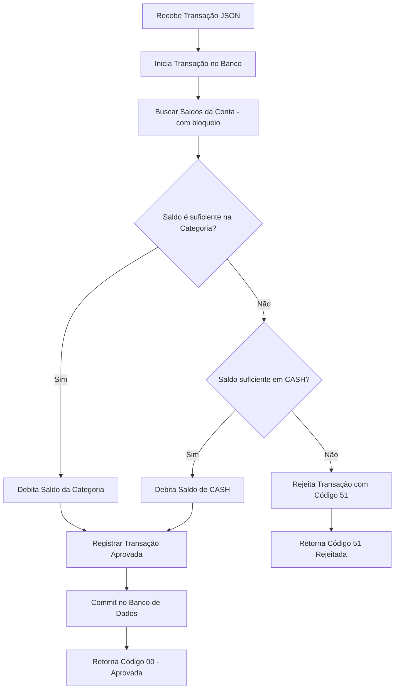
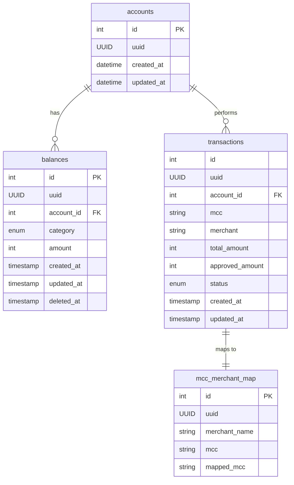

<a id="header"></a>

<!-- 
    Logo image generated by Bing IA: https://www.bing.com/images/create/
    Prompt: gopher azul, simbolo da linguagem golang com um bone laranja, trabalhando como caixa de supermercado com algumas maquinhas de cartão de credito e cartões em cima da mesa, estilo cartoon, historia em quadrinhos, fundo branco chapado para facilitar remoção
-->
[](#rgo-turn-based-challenge)

<!-- 
    icons by:
    https://devicon.dev/
    https://simpleicons.org/
-->
[](https://go.dev/) [](https://gin-gonic.com/) [](https://www.postgresql.org/) [](https://www.docker.com/) [](https://ubuntu.com/) [](https://github.com/spf13/viper) [](https://github.com/jtonynet)  [](https://code.visualstudio.com/) [](https://swagger.io/) [](https://mermaid.js.org/) [](https://docs.github.com/en/actions) <!-- [](https://prometheus.io/) [](https://grafana.com/)  [](https://gatling.com/) [](https://redis.com/) [](https://rabbitmq.com/) -->


 [](https://github.com/users/jtonynet/projects/7/views/1) <!--  -->

---

## 🕸️ Redes

[](https://www.linkedin.com/in/jos%C3%A9-r-99896a39/) [](https://dev.to/learningenuity) [](mailto:learningenuity@gmail.com)

---

## 📁 O Projeto

<a id="index"></a>
### ⤴️ Índice

__[Go Payments API](#header)__<br/>
  1.  ⤴️ [Índice](#index)
  2.  📖 [Sobre](#about)
  3.  💻 [Rodando o Projeto](#run)
      - 🌐 [Ambiente](#environment)
      - 🐋 [Conteinerizado](#run-containerized)
      - 🏠 [Local](#run-locally)
  4.  📰 [Documentação da API](#apidocs)
  5.  📊 [Diagramas](#diagrams)
      - 📈 [Fluxo](#diagrams-flowchart)
      - 📈 [ER](#diagrams-erchart)
  6.  ✅ [Testes](#tests)
  7.  🪲 [Debug](#debug)
  8.  👏 [Boas Práticas](#best-practices)
  9.  🧠 [ADR - Architecture Decision Records](#adr)
  10. 🔢 [Versões](#versions)
  11. 🧰 [Ferramentas](#tools)
  12. 🤖 [Uso de IA](#ia)
  13. 🏁 [Conclusão](#conclusion)

---

<a id="about"></a>
### 📖 Sobre

Acompanhe as tarefas pelo __[Kanban](https://github.com/users/jtonynet/projects/7/views/1)__

Este repositório foi criado com a intenção de propor uma possível solução para o seguinte desafio:

> <br/>
> 
> 👨‍💻 __Desafio Técnico:__
>
> Além de avaliar a correção da sua solução, temos interesse em ver como você modela o domínio, organiza seu código e implementa seus testes. 
>
>
> __Linguagem e bibliotecas:__
> 
> Na *********, usamos Scala e Kotlin no nosso dia a dia (e demonstrar experiência em alguma delas é um grande diferencial). No entanto, você pode implementar sua solução utilizando sua linguagem favorita, dando preferência ao paradigma de programação funcional.
>
> __Como entregar a solução?__
> 
> Entregue a sua solução preferencialmente criando um repositório git (Github, Gitlab, etc).
>
> É muito importante escrever um arquivo README com as instruções para execução do projeto.
> 
> Agora, vamos guiá-lo através de alguns conceitos básicos.
> 
> <br/>
> 
> ---
> 
> <br/>
> 
> __Transaction__
>
> Uma versão simplificada de um transaction payload de cartão de crédito é o seguinte:
>
> ```json
> {
> 	"account": "123",
> 	"totalAmount": 100.00,
> 	"mcc": "5811",
> 	"merchant": "PADARIA DO ZE               SAO PAULO BR"
> }
> ```
>
>
> __Atributos__
>
> - **id** - Um identificador único para esta transação.
> - **accountId** - Um identificador para a conta.
> - **amount** - O valor a ser debitado de um saldo.
> - **merchant** - O nome do estabelecimento.
> - **mcc** - Um código numérico de 4 dígitos que classifica os estabelecimentos comerciais de acordo com o tipo de produto vendido ou serviço prestado.
>    
>    O `MCC` contém a classificação do estabelecimento. Baseado no seu valor, deve-se decidir qual o saldo será utilizado (na totalidade do valor da transação). Por simplicidade, vamos usar a seguinte regra:
>    
>    - Se o `mcc` for `"5411"` ou `"5412"`, deve-se utilizar o saldo de `FOOD`.
>    - Se o `mcc` for `"5811"` ou `"5812"`, deve-se utilizar o saldo de `MEAL`.
>    - Para quaisquer outros valores do `mcc`, deve-se utilizar o saldo de `CASH`.
>
> <br/>
> 
> ---
>
> <br/>
> 
> __Desafios (o que você deve fazer)__
> 
> Cada um dos desafios a seguir são etapas na criação de um autorizador completo. Seu autorizador deve ser um servidor HTTP que processe a transaction payload JSON usando as regras a seguir.
>
> As possíveis respostas são:
> - `{ "code": "00" }` se a transação é **aprovada**
> - `{ "code": "51" }` se a transação é **rejeitada**, porque não tem saldo suficiente
> - `{ "code": "07" }` se acontecer qualquer outro problema que impeça a transação de ser processada
>
> __O HTTP Status Code é sempre `200`__
> 
>
><br/>
>
> 1. __L1. Autorizador simples__
>     - O __autorizador simples__ deve funcionar da seguinte forma:
>       -  Recebe a transação
>       -  Usa **apenas** a MCC para mapear a transação para uma categoria de benefícios
>       -  Aprova ou rejeita a transação
>       -  Caso a transação seja aprovada, o saldo da categoria mapeada deverá ser diminuído em __totalAmount__.
>
> 2. __L2. Autorizador com fallback__
>     - Para despesas não relacionadas a benefícios, criamos outra categoria, chamada __CASH__. O autorizador com fallback deve funcionar como o autorizador simples, com a seguinte diferença:
>       - Se a MCC não puder ser mapeado para uma categoria de benefícios ou se o saldo da categoria fornecida não for suficiente para pagar a transação inteira, verifica o saldo de **CASH** e, se for suficiente, debita esse saldo.
>
> 3. __L3.Dependente do comerciante__
>     - As vezes, os MCCs estão incorretos e uma transação deve ser processada levando em consideração também os dados do comerciante. Crie um mecanismo para substituir MCCs com base no nome do comerciante. O nome do comerciante tem maior precedência sobre as MCCs.
>     - Exemplos:
>       - `UBER TRIP                   SAO PAULO BR`
>       - `UBER EATS                   SAO PAULO BR`
>       - `PAG*JoseDaSilva          RIO DE JANEI BR`
>       - `PICPAY*BILHETEUNICO           GOIANIA BR`
>   
> 4. __L4. Questão aberta__
>     - A seguir está uma questão aberta sobre um recurso importante de um autorizador completo (que você não precisa implementar, apenas discuta da maneira que achar adequada, como texto, diagramas, etc.).
>       - Transações simultâneas: dado que o mesmo cartão de crédito pode ser utilizado em diferentes serviços online, existe uma pequena mas existente probabilidade de ocorrerem duas transações ao mesmo tempo. O que você faria para garantir que apenas uma transação por conta fosse processada em um determinado momento? Esteja ciente do fato de que todas as solicitações de transação são síncronas e devem ser processadas rapidamente (menos de 100 ms), ou a transação atingirá o timeout.
> 
> <br/>
> 
> ---
>
> <br/>
> 
> _Para este teste, tente ao máximo implementar um sistema de autorização de transações considerando todos os desafios apresentados (L1 a L4) e conceitos básicos._
> 
> <br/>

<br/>

O desafio sugere `Scala`, `Kotlin` e o `paradigma de programação funcional`, evidenciando preferências, mas aceitando subscrições com outras linguagens e paradigmas. Realizarei em `Golang`, com arquitetura `hexagonal`, por maior familiaridade e experiência.

Contudo, sou aberto a expandir minhas habilidades, e disposto a aprender e adotar novas tecnologias e paradigmas conforme necessário.

<br/>

[⤴️ de volta ao índice](#index)

---

<a id="run"></a>
### 💻 Rodando o Projeto

__TODO__

<a id="environment"></a>
#### 🌐 Ambiente
<br/>

<a id="run-containerized"></a>
#### 🐋 Conteinerizado 
<br/>

<a id="run-locally"></a>
#### 🏠 Local
<br/>

<br/>

[⤴️ de volta ao índice](#index)

---

<a id="apidocs"></a>
### 📰  Documentação da API

__TODO__

<br/>

[⤴️ de volta ao índice](#index)

---

<a id="diagrams"></a>
### 📊 Diagramas do Sistema
_*Diagramas embrionários_

_**Diagramas Mermaid podem apresentar problemas de visualização em aplicativos mobile_

<!-- 
    diagrams by:
    https://mermaid.js.org/
-->

<a id="diagrams-flowchart"></a>
#### 📈 Fluxo



##### 📝 Descrição

1. **Recebe Transação JSON**: O sistema recebe o payload de transação.

2. **Inicia Transação no Banco**: Abre uma transação no banco de dados para garantir atomicidade.

3. **Buscar Saldos da Conta**: A conta e os saldos (FOOD, MEAL, CASH) são buscados no banco de dados com um bloqueio exclusivo para evitar concorrência.

4. **Saldo é suficiente na Categoria?**: Verifica se o saldo disponível na categoria mapeada (com base no MCC) é suficiente.
    - Se sim, debita o saldo da categoria correspondente.
    - Se não, verifica o saldo de CASH.

5. **Saldo suficiente em CASH?**: Se a categoria principal não tiver saldo suficiente, o sistema verifica o saldo de CASH.
    - Se sim, debita o saldo de CASH.
    - Se não, rejeita a transação com o código "51" (fundos insuficientes).

6. **Registrar Transação Aprovada**: A transação aprovada é registrada no banco de dados.

7. **Commit no Banco de Dados**: Confirma a transação no banco, persistindo as mudanças.

8. **Retorna Código "00"**: Se a transação foi aprovada, retorna o código "00" (aprovada).

9. **Retorna Código "51"**: Se a transação foi rejeitada por falta de fundos, retorna o código "51".


<br/>

_*Esse fluxo representa o processo de aprovação, fallback e rejeição da transação com base nos saldos e MCC, garantindo bloqueio exclusivo ao manipular os saldos._

---

<br/>

<a id="diagrams-erchart"></a>
#### 📈 Entidade Relacionamento



##### 📝 Descrição

**Accounts** é a tabela principal, conectada tanto a **Balances** quanto a **Transactions**, armazenando informações sobre as contas.  
**Balances** armazena os saldos por categoria.  
**Transactions** registra o histórico de transações realizadas, enquanto **MCC_Merchant_Map** ajusta MCCs incorretos de acordo com o nome do comerciante.

_*Esse diagrama oferece uma visão clara de como modelar as entidades principais e seus relacionamentos para atender aos requisitos do sistema de autorização de transações._


<br/>

[⤴️ de volta ao índice](#index)

---

<a id="tests"></a>
### ✅ Testes

__TODO__

<br/>

[⤴️ de volta ao índice](#index)

---

<a id="debug"></a>
### 🪲 Debug

__TODO__

<br/>

[⤴️ de volta ao índice](#index)

---

<a id="best-practices"></a>
### 👏 Boas Práticas

- [Swagger](https://swagger.io/)
- [Github Project - Kanban](https://github.com/users/jtonynet/projects/7/views/1)
- [Semantic Versioning 2.0.0](https://semver.org/spec/v2.0.0.html)
- [Conventional Commits](https://www.conventionalcommits.org/en/v1.0.0/)
- [Keep a Changelog](https://keepachangelog.com/en/1.0.0/)
- [ADR - Architecture Decision Records](https://cognitect.com/blog/2011/11/15/documenting-architecture-decisions)
- [Mermaid Diagrams](https://mermaid.js.org)
<!--
- [Observabilidade](https://en.wikipedia.org/wiki/Observability_(software)) com:
  - [Prometheus](.)
  - [Grafana](https://grafana.com/)
-->

<br/>

[⤴️ de volta ao índice](#index)

---

<a id="adr"></a> 
### 🧠 ADR - Architecture Decision Records

- [0001: Registro de Decisões de Arquitetura (ADR)](./docs/architecture/decisions/0001-registro-de-decisoes-de-arquitetura.md)
- [0002: Go, Gin, Gorm e PostgreSQL com Arquitetura Hexagonal e TDD](./docs/architecture/decisions/0002-go-gin-gorm-e-postgres-com-arquitetura-hexagonal-tdd.md)


<br/>

[⤴️ de volta ao índice](#index)

---

<a id="versions"></a>
### 🔢 Versões

As tags de versões estão sendo criadas manualmente a medida que o projeto avança com melhorias notáveis. Cada funcionalidade é desenvolvida em uma branch a parte (Branch Based, [feature branch](https://www.atlassian.com/git/tutorials/comparing-workflows/feature-branch-workflow)) quando finalizadas é gerada tag e mergeadas em master.

Para obter mais informações, consulte o [Histórico de Versões](./CHANGELOG.md).

<br/>

[⤴️ de volta ao índice](#index)

---

<a id="tools"></a>
### 🧰 Ferramentas


- Linguagem:
  - [Go](https://go.dev/)
  - [GVM v1.0.22](https://github.com/moovweb/gvm)

- Framework & Libs:
  - [Gin](https://gin-gonic.com/)
  - [GORM](https://gorm.io/index.html)
  - [Viper](https://github.com/spf13/viper)
  - [Gin-Swagger](https://github.com/swaggo/gin-swagger)
  - [gjson](https://github.com/tidwall/gjson)
  - [uuid](github.com/google/uuid)
<!-- 
  - [gin-contrib/pprof](https://github.com/gin-contrib/pprof)
  - [Exponential Backoff](https://github.com/cenkalti/backoff)
  - [go-redis](https://github.com/redis/go-redis)
  - [amqp091-go](https://github.com/rabbitmq/amqp091-go)
-->

- Infra & Tecnologias
  - [Docker v24.0.6](https://www.docker.com/)
  - [Docker compose v2.21.0](https://www.docker.com/)
  - [Postgres v16.0](https://www.postgresql.org/)
<!--
  - [Gatling v3.9.5](https://gatling.io/)
  - [Redis 6.2](https://redis.io/)
  - [RabbitMQ v3.12.6](https://www.rabbitmq.com/)
-->

- GUIs:
  - [VsCode](https://code.visualstudio.com/)
  - [DBeaver](https://dbeaver.io/)
<!--
  - [another-redis-desktop-manager](https://github.com/qishibo/AnotherRedisDesktopManager)
-->

<br/>

[⤴️ de volta ao índice](#index)

---

<a id="ia"></a>
### 🤖 Uso de IA

A figura do cabeçalho nesta página foi criada com a ajuda de inteligência artificial e um mínimo de retoques e construção no Gimp [](https://www.gimp.org/)


__Os seguintes prompts foram usados para criação no  [Bing IA:](https://www.bing.com/images/create/)__


<details>
  <summary><b>Gopher caixa de mercado</b></summary>
"gopher azul, simbolo da linguagem golang com um bone laranja, trabalhando como caixa de supermercado com algumas maquinhas de cartão de credito e cartões em cima da mesa, estilo cartoon, historia em quadrinhos, fundo branco chapado para facilitar remoção"<b>(sic)</b>
</details>

<br/>

IA também é utilizada em minhas pesquisas e estudos como ferramenta de apoio; no entanto,  __artes e desenvolvimento são, acima de tudo, atividades criativas humanas. Valorize as pessoas!__

Contrate artistas para projetos comerciais ou mais elaborados e aprenda a ser engenhoso!

[⤴️ de volta ao índice](#index)

<br/>

---

<a id="conclusion"></a>
### 🏁 Conclusão

__TODO__

😊🚀

<br/>

[⤴️ de volta ao índice](#index)

---

<!-- 
// Removendo processos de uma porta. ex.: 3000
sudo kill -9 $(lsof -t -i:3000)

//LIMPANDO DOCKER
docker stop $(docker ps -aq)
docker rm $(docker ps -aq)

docker rmi $(docker images -q) --force

docker volume rm $(docker volume ls -q) --force

docker network prune -f

docker system prune -a --volumes

sudo systemctl restart docker
-->
