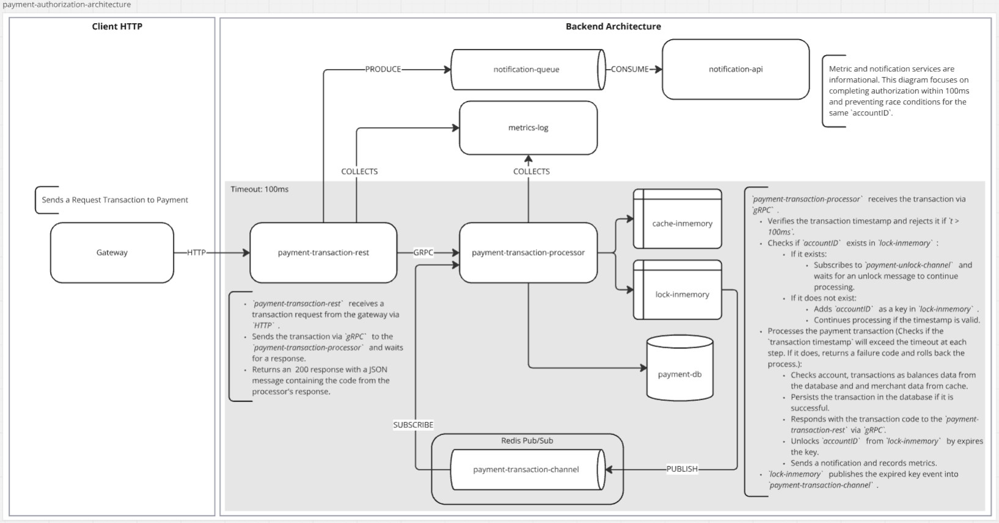
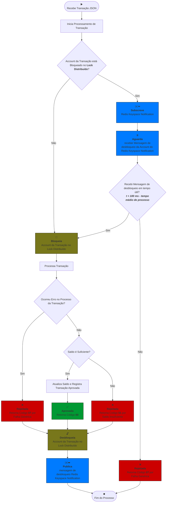

# 3. gRPC e Redis Keyspace Notification em API REST e Worker para reduzir Latência e evitar Concorrência

Data: 10 de Novembro de 2024

## Status

Aceito

## Contexto

### Questão Aberta L4

Para mitigar Transações com Account concorrente, sugeri `Locks Distribuídos` com `Bloqueio Pessimista` para `fail fast` e complementei com o uso de `filas` fazendo com que as instâncias da `API` se comunicassem para que ao remover um `lock` o processamento que aguardava essa remoção, ocorresse.

No decorrer deste documento, uma alternativa ao uso de filas é discutida e justificada para futura implementação

### Meet de Arquitetura no Miro

No dia __05/11/2024__, foi conduzida uma reunião onde foram apresentados outros desafios técnicos e arquiteturais, visando melhorias na aplicação desenvolvida até aqui, relacionadas à redução de latência de resposta e à prevenção de concorrência.

Tendo isso em mente, durante uma sessão de `Google Meet` um `Miro Board` foi aberto com o seguinte enunciado:

>  
> Cada usuário ***** possui uma conta, cada conta possui 3 categorias de saldo (Alimentação, Mobilidade e Saúde). Uma nova transação é recebida via maquininha;
> Para processar essa transação, o Autorizador consultará os saldos das categorias da conta **** do usuário e com base no tipo do estabelecimento fará o débito na categoria correta.
> 
> - Autorização precisa ser confirmado em menos de 100ms;
> - Precisamos salvar o extrato das transações;
> - Mandar notificação para usuário;
>  
> 

>  
> 
> Entendimento do Problema:
> - Faça perguntas pertinentes para esclarecer aspectos do problema, se necessário.
> - Proponha uma solução arquitetural para resolver o problema apresentado.
>  
> 

>  
> 
> Modelo de Banco de Dados:
> - Defina um modelo de banco de dados mínimo, incluindo as principais tabelas e colunas necessárias para suportar o produto.
>  
> 

>  
> 
>Definição dos Serviços:
> - Identifique os serviços necessários para implementar a solução proposta.
> - Descreva ao entrevistador a responsabilidade de cada serviço.
> - Considere a modularidade, escalabilidade e manutenibilidade dos serviços.
>  
> 

>  
> 
> Comunicação entre os Serviços:
> - Descreva como os serviços irão se comunicar entre si.
> - Escolha os protocolos de comunicação adequados para garantir uma integração eficiente e confiável.
>  
> 

>  
> 
> Design Patterns:
> - Sugira quais design patterns seriam aplicáveis à solução proposta.
> - Justifique a escolha de cada design pattern e explique como ele contribui para a solução.
>  
>  

Embora o enunciado do `Miro` não cite, a concorrência do requisito L4 deve ser levada em consideração.

#### Perguntas que foram feitas antes iniciar o diagrama:

>  
> 
> - Qual é o problema para o negócio de perder uma transação?
> - Devemos falhar rapidamente ou retentar os processos que falharam?
> - Atualmente, o sistema apenas persiste no banco as transações que obtiveram sucesso, mas isso não é o ideal. Metricas e Logs são considerados?
> - Entre persistência e latência, o que é prioritário?
> - Além de latência, persistência e notificação, quais outras restrições devo levar em consideração neste desafio?
> - Qual é o volume diário de transações?
> 
>  

 

O Diagrama produzido nesse `meeting` se encontra abaixo:

As questões de protocolos e patterns e outras, embora não estejam presentes no diagrama, foram esclarecidas de maneira verbal ao longo da reunião. Esse documento procura se ater as questões de concorrência especificadas do requisito L4. Demais features da arquitetura, caso decida implementar, ganharão seus proprios ADRs (`notification-api`, `metrics-log`), embora tenha fortes ideias de como implantá-los.

## Decisão

Vamos utilizar [`Redis Keyspace Notifications`](https://redis.io/docs/latest/develop/use/keyspace-notifications/) para notificar desbloqueio de `locks`, segregar a API de payments em duas, uma API rest e um worker. Utilizar `gRPC` para efetuar a comunicacao entre ambas.

### Justificativa

No decorrer da reunião, o uso de `filas` para comunicar o desbloqueio, foi desencorajado pelo proponente do desafio devido à latência adicional que seria gerada. Como os casos de concorrência, embora ocorram, são um baixo percentual no volume diário, uma abordagem `pub/sub` com `fire and forget` foi considerada uma boa opção, desde que fosse leve e adicionasse baixa latência à operação.

Com esses critérios em mente, e tendo em vista que já havia sugerido o uso de `Redis` para o `Lock Distribuído`, pavimentamos o caminho para o uso de [`Redis Keyspace Notifications`](https://redis.io/docs/latest/develop/use/keyspace-notifications/) em nossa arquitetura.

Outros critérios decisivos foram segurança e isolamento.

#### Redis
Baixa latência e segurança para armazenar e responder de maneira distribuída ao grande volume de instâncias que o serviço pode alcançar. Solução já testada pelo mercado, amplamente utilizada, de fácil implementação.

#### API REST e worker segregados
Para garantir segurança e isolamento de nossos processos, mesmo sem utilizarmos a abordagem clássica de filas para `producers` e `workers`, iremos segregar a REST API de pagamento em `payment-rest-api` e `payment-worker-api`. Isso garantirá que os clientes da REST API não tenham acesso direto a quaisquer detalhes da execução da transação. Embora essa abordagem adicione uma complexidade adicional, o ganho obtido é evidente.

#### gRPC
Como vamos segregar `payment-rest-api` e `payment-worker-api`, precisamos de um protocolo leve e rápido para garantir a comunicação entre essas duas peças de software, sem impactar a latência geral do sistema. `gRPC` é a escolha mais acertada nesse cenário, na época em que este documento foi desenvolvido.

#### Redis Keyspace Notification
Ficou evidente, pelo fato de podermos publicar mensagens no momento em que uma chave do nosso `memory-lock` no `Redis` sofresse alguma deleção pelo processo ou pelo `ttl`, que o uso do `Keyspace Notification` seria uma alternativa que nos garantiria a baixa latência esperada. Seu principal `trade-off` é a não garantia da entrega (`fire and forget`). No entanto, sendo essa concorrência rara, o serviço que subscreve o `channel` para receber essa mensagem sendo confiável, e apenas instâncias da nossa API que se encontram com o processamento preso pela condição de corrida irão subscrever o `channel`, essa abordagem se demonstrou sólida e eficiente no cenário proposto.

#### Novo DIagrama Miro
Foi inserido maior contexto ao diagrama, para que, sozinho, ele já seja expressivo (embora tenha ficado mais poluído com o texto). Os protocolos entre as APIs foram definidos, e a parte do sistema onde a latência de 100ms mais importa foi evidenciada.  
A única alteração arquitetural feita nesse diagrama, se comparado ao da reunião, foi mover o `subscriber` para a `payment-worker-api`. Ele faz mais sentido lá, tendo em vista que a chamada gRPC é síncrona.

**Patterns Utilizados:**
- Cache Aside
- Circuit Breaker
- Message Queue

 

 

Na 'Questão Aberta L4' do arquivo README do projeto, a sugestão do uso de `filas` foi removida e o diagrama do uso de `memory-lock` foi atualizado para uma versão que refletisse uma representação da proposta de arquitetura atual do sistema. Segue abaixo:

## Consequências

A concorrência será mitigada com essas peças de software e sugestões de implementação, sem a necessidade de um robusto sistema de filas para validar o processamento dentro da `SLA` de pagamento de 100ms. Como `trade-off`, perdemos o reprocessamento e a persistência que teríamos com filas, o que podemos mitigar com o uso de `métricas` e `logs` que foram previstos no desafio, mas não devo implantar por ora. A solução é satisfatória e deve atender às demandas do negócio. 

É importante validar continuamente o impacto dessa decisão à medida que o volume de transações cresce. De todas as formas, como o sistema foi desenvolvido de maneira `hexagonal`, não é complicado alterar a forma como o `unlock` é feito, de `pub/sub` para `filas` ou outros, no futuro, se fizer sentido.

