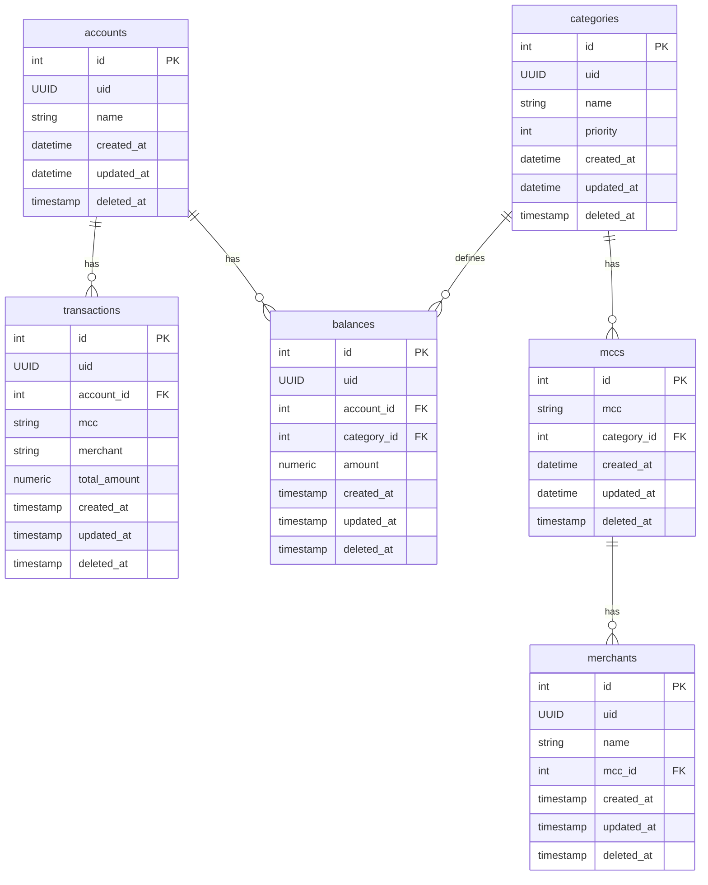
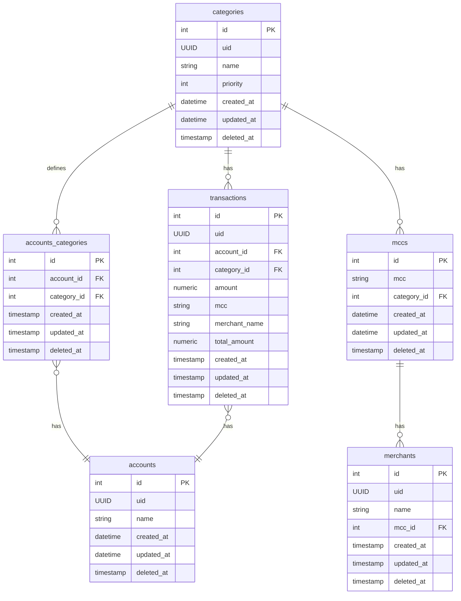

# 4. Banco Relacional Modelado de Maneira Orientada a Eventos

Data: 19 de Novembro de 2024

## Status

Aceito

## Contexto

### Mitigar Inconsistência (Eventual) em modelo com `balances` e `transactions`
O modelo `ER` original do projeto, visto abaixo, possui as tabelas `balances` e `transactions`, responsáveis pelos saldos por `categories` de cada registro de `accounts`. Geralmente proposto em estágios iniciais de desenvolvimento em modelos relacionais que sigam as `formas normais`, foi útil ao desenvolvimento das principais features.

No entanto, em uma reunião com apresentação em `Miro Board`, foi sugerido que esse modelo poderia não apresentar a melhor performance em um cenário de serviço com finalidade financeira, concorrência e necessidade de baixa latência. Além disso, foi apontada uma possível `inconsistência` no modelo, uma vez que eram necessárias duas consultas (um *insert* em `transaction` e *updates* nos `balances`) para registrar uma transação. De fato, a performance em persistência ficava prejudicada.

Embora estratégias como o uso de `transações de banco de dados` e `serviços de compensação` sejam boas abordagens para mitigar a `inconsistência`, este ADR visa repensar e propor uma alternativa mais aderente ao modelo até então definido.

 

## Decisão
Uma abordagem baseada em `EDA` (*Event Driven Architecture*), embora não faça completo sentido (um `request transaction` não é um evento de fato, mas uma solicitação de pagamento, ou seja, a origem de um evento), é totalmente aderente ao percebermos que as próprias `transactions` pertencem a uma `account` e podem ser vinculadas a `categories`, `mcc` e `merchant`. Assim, ao armazenar o saldo em seu `amount`, os ganhos em `rastreabilidade`, `latência` e mitigação de inconsistências (apenas uma `query` será necessária para registrar a movimentação) que a `imutabilidade` garantem tornam-se evidentes.

A evolução para o modelo a seguir foi proposta:

 

## Consequências

Os ganhos em performance de persistência (uma consulta de `insert` em vez de uma de `insert` e outra de `update`) e a `rastreabilidade` são os principais benefícios. Embora a consulta para recuperar os dados possa ser mais onerosa, de maneira geral, a abordagem proposta é mais eficiente e funcional.

O tempo de resposta geral deve ser reduzido devido à diminuição de operações custosas ao banco, e a mitigação da `inconsistência eventual` representa um benefício adicional.
