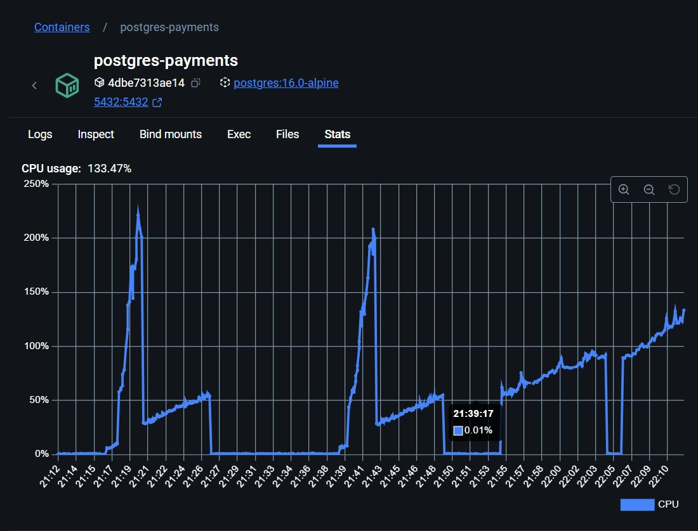

# 7. Tabela Auxiliar para melhoria de Performance

Data: 28 de Dezembro de 2024

## Status

Aceito

## Contexto

### Melhorar a Performance para obter as últimas `transactions` de uma `account` reduzindo processamento

Com `Testes de stress` efetuados em um [Notebook ROG Strix G16 - 13ª Geração](https://br.store.asus.com/notebook-gamer-rog-strix-g16-13-geracao.html?config=90NR0D41-M00Y60) (resultados podem variar dependendo das configurações e processos abertos na máquina) através do cliente sintético `Gatling`, foi possível obter um panorama geral da performance da aplicação. Nesta máquina, conseguimos atingir de maneira estável `400 TPS`, valor acima do altamente desejável `100 TPS` e significativamente superior à volumetria média esperada pelo proponente (`2 TPS` e 10x isso, ou seja, `20 TPS` em horário de pico).

Contudo, esses testes abriram possibilidades de melhoria em relação às consultas, uma vez que, utilizando o `Docker Desktop`, foi possível observar o excesso de uso de `CPU` no `container` do banco `Postgres`. O resultado mais evidente desse uso é a degradação dos tempos de consulta para obter as `accounts` e suas respectivas `transactions` conforme o banco cresce em registros.

Este documento visa discutir a estratégia adotada para mitigar o excesso de uso do banco, principal responsável pela degradação da performance da `API`.

    

 

## Decisão
Foram realizadas alterações pontuais no banco `Postgres` e na `Repository` de `accounts`, sem grandes impactos na `codebase` `GO`. Novos índices foram criados, porém sem obter ganhos significativos.

Partimos para uma solução mais robusta: adotamos uma `Tabela Auxiliar` `transactions_latest` com os dados das `transactions` por `accounts`. Essa tabela torna o tempo da consulta constante, independentemente do volume de `transactions` previamente inseridas. Ela é atualizada através de uma `Trigger` sobre o `Insert` de `transcations`, aumentando consideravelmente a performance da `API` reduzindo o uso de CPU do banco na consulta, independentemente da quantidade de registros existentes.

 

## Consequências

A abordagem se mostrou sólida em nossos testes de carga e stress locais, reduzindo o consumo de `CPU` do banco, reduzindo tempos de respostas para atender com folga ao `timeoutSLA` de `100ms` _"exigidos pelo desafio"_. Na máquina alvo dos testes, conseguimos passar dos desejáveis `100 TPS` com certa facilidade. Outras máquinas mais modestas se apresentam estáveis entre `25 a 50 TPS`.

Tenha em mente que esses números se devem ao desenvolvimento local e podem variar. Contudo, com essa investigação e melhorias deve ser notável o ganho de performance em cenários de produção.

    

