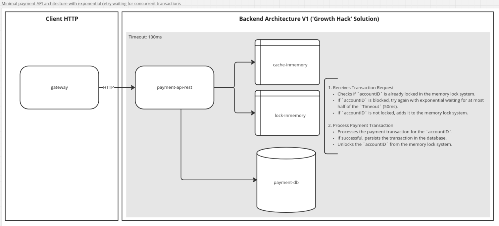
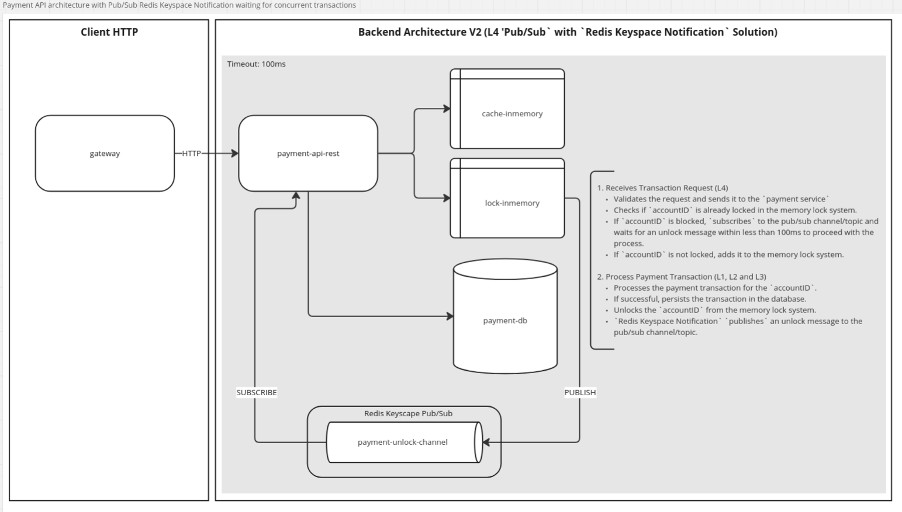

**Evolução Arquitetura do Projeto** 

1. **Unlock with BackOff Exponential (Growth Hack's Solution)** 
Arquitetura mínima atendendo requisito `L4`, com retentativas de aquisição de lock em caso de concorrência. Embora ainda não esteja em sua versão final, a implementação está funcional, validando em forma de `MVP` com uma solução de `Lock Distribuído`. Abordagem `Growth Hack`, que deverá escalar conforme o sugerido em __Questão Aberta L4__ e na ADR [0003: gRPC e Redis Keyspace Notification em API REST e Worker para reduzir Latência e evitar Concorrência](./docs/architecture/decisions/0003-grpc-e-redis-keyspace-notification-em-api-rest-e-worker-para-reduzir-latencia-e-evitar-concorrencia.md).
    

        
    

 
 

1. **Pub/Sub Redis Keyspace Notification** 
Arquitetura atendendo ao requisito `L4`, agora com a utilização de notificações do `Redis Keyspace Notification` para gerenciar locks em cenários de concorrência. A implementação elimina retentativas desnecessárias, substituindo-as por uma abordagem baseada em eventos assíncronos. O sistema aguarda mensagens de desbloqueio em um canal `pub/sub` (`payment-unlock-channel`), garantindo maior eficiência. A solução está funcional, com um modelo de `Lock Distribuído`, projetada para escalar conforme sugerido em __Questão Aberta L4__ e na ADR [0003: gRPC e Redis Keyspace Notification em API REST e Worker para reduzir Latência e evitar Concorrência](./docs/architecture/decisions/0003-grpc-e-redis-keyspace-notification-em-api-rest-e-worker-para-reduzir-latencia-e-evitar-concorrencia.md).
    

        
    
